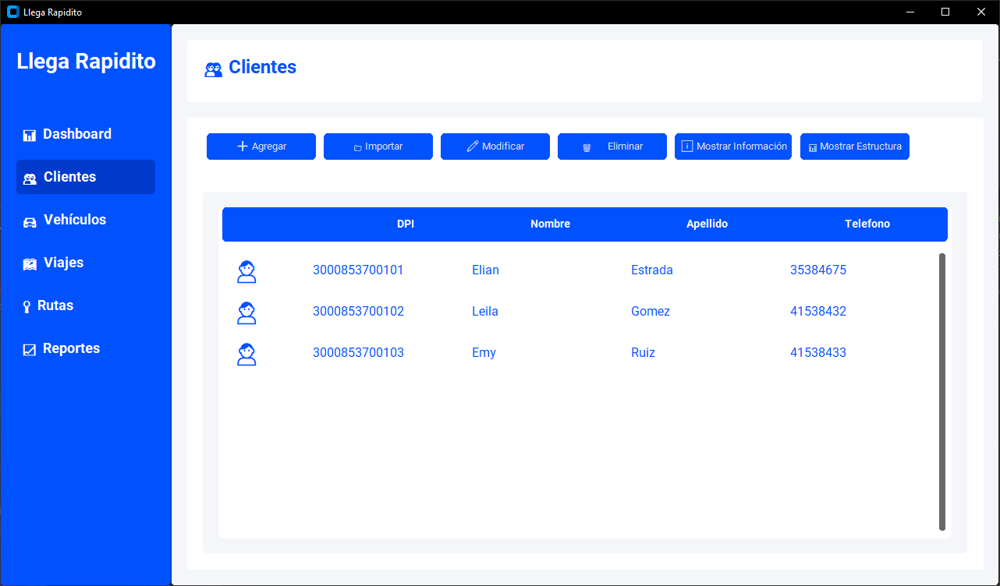
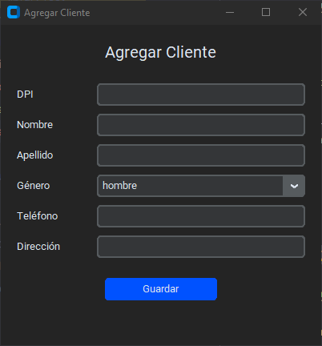
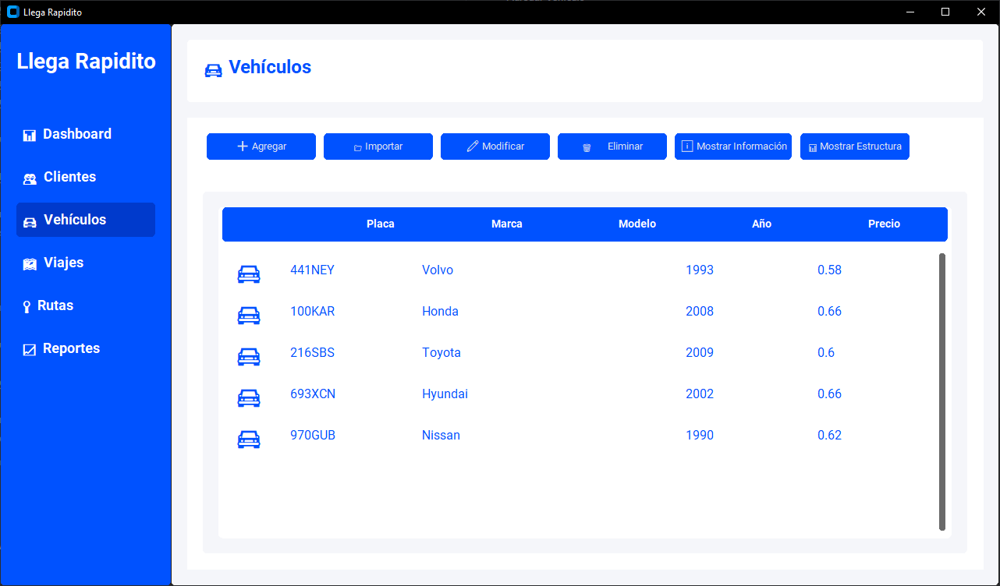
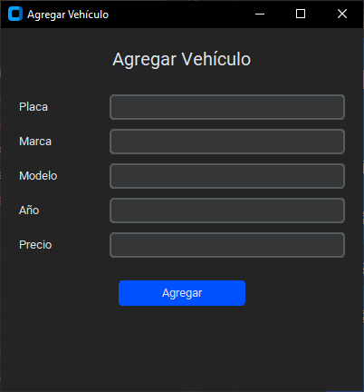
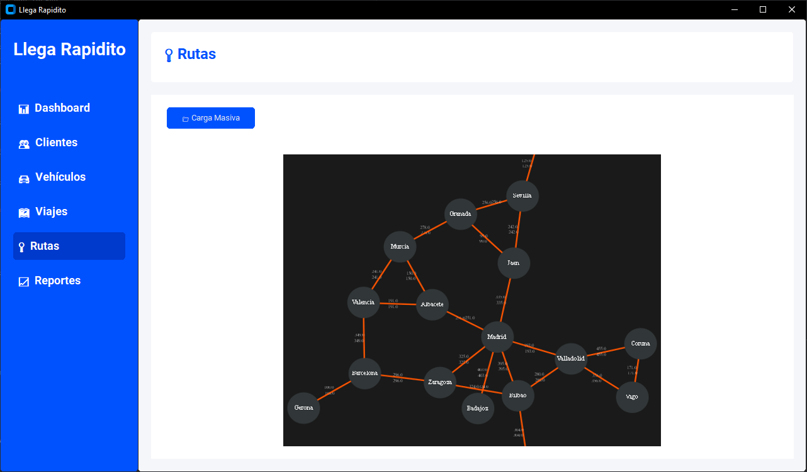
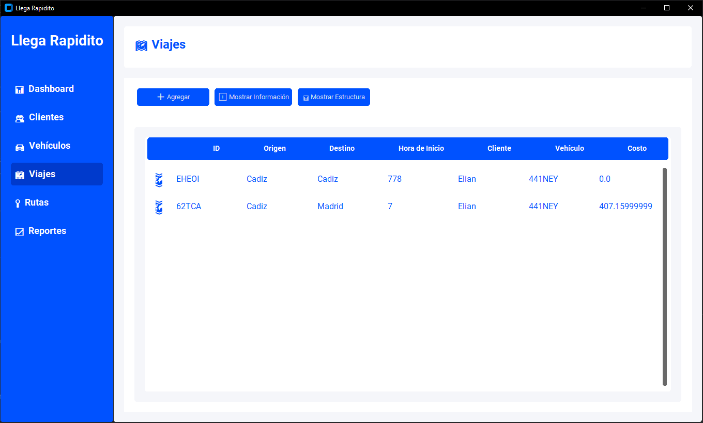
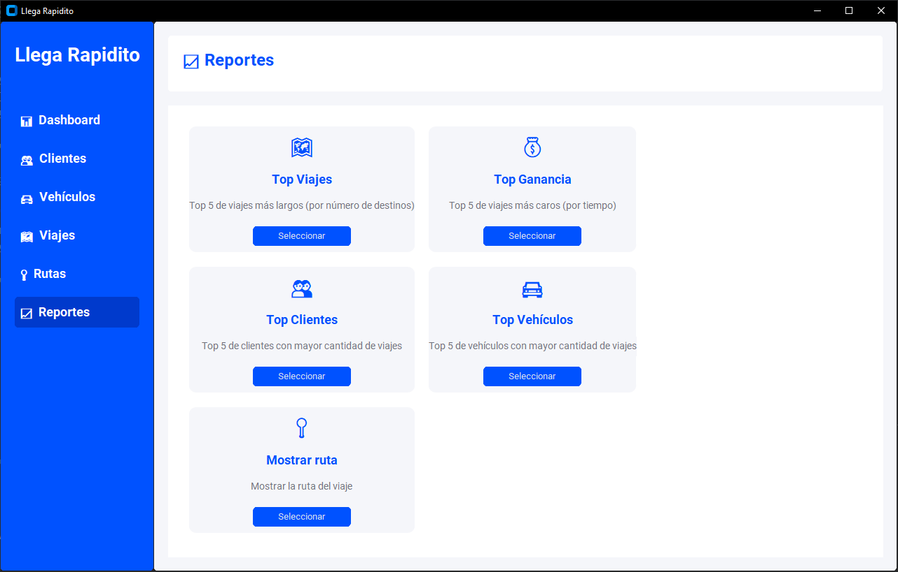

# Manual de Usuario - Sistema Llega Rapidito

## Índice

1. [Introducción](#introducción)
2. [Requisitos del Sistema](#requisitos-del-sistema)
3. [Inicio del Sistema](#inicio-del-sistema)
4. [Interfaz Principal](#interfaz-principal)
5. [Gestión de Clientes](#gestión-de-clientes)
6. [Gestión de Vehículos](#gestión-de-vehículos)
7. [Gestión de Rutas](#gestión-de-rutas)
8. [Gestión de Viajes](#gestión-de-viajes)
9. [Reportes](#reportes)

## Introducción

Bienvenido al manual de usuario del Sistema Llega Rapidito, una aplicación diseñada para gestionar el control de vehículos, clientes y viajes de la empresa de transporte. Este manual le guiará a través de todas las funcionalidades disponibles en el sistema.

## Requisitos del Sistema

Para ejecutar el Sistema Llega Rapidito, necesitará:

- Python 3.x instalado
- Librería CustomTkinter
- Graphviz instalado en el sistema

## Inicio del Sistema

Al iniciar el sistema, se presentará la pantalla principal con un menú lateral que contiene las siguientes opciones:

- Dashboard
- Clientes
- Vehículos
- Viajes
- Rutas
- Reportes

## Interfaz Principal

La interfaz principal está dividida en dos secciones:

1. Menú lateral (izquierda)
2. Área de contenido (derecha)

El área de contenido cambiará según la opción seleccionada en el menú lateral.

## Gestión de Clientes

### Funciones Disponibles:

- Agregar Cliente
- Importar Clientes
- Modificar Cliente
- Eliminar Cliente
- Mostrar Información
- Mostrar Estructura

### Agregar Cliente

1. Haga clic en el botón "➕ Agregar"
2. Complete los campos requeridos:
   - DPI
   - Nombres
   - Apellidos
   - Teléfono



### Importar Clientes

1. Haga clic en "📁 Importar"
2. Seleccione el archivo de texto con el formato:
   ```
   DPI, Nombres, Apellidos, Género, Teléfono, Dirección;
   ```

]

## Gestión de Vehículos

### Funciones Disponibles:

- Agregar Vehículo
- Importar Vehículos
- Modificar Vehículo
- Eliminar Vehículo
- Mostrar Información
- Mostrar Estructura



### Agregar Vehículo

1. Haga clic en "➕ Agregar"
2. Complete los campos:
   - Placa
   - Marca
   - Modelo
   - Precio por segundo



### Importar Vehículos

1. Haga clic en "📁 Importar"
2. Seleccione el archivo con el formato:
   ```
   Placa : Marca : Modelo : Precio;
   ```

## Gestión de Rutas

### Carga de Rutas

Al iniciar el sistema, se le solicitará cargar un archivo de rutas con el formato:

```
Lugar Origen / Lugar Destino / Tiempo de Ruta %
```



## Gestión de Viajes

### Crear Nuevo Viaje

1. Seleccione cliente
2. Seleccione vehículo
3. Seleccione origen y destino
4. El sistema calculará automáticamente la mejor ruta



## Reportes

El sistema ofrece los siguientes reportes:

- Top 5 viajes más largos
- Top 5 viajes más caros
- Top 5 clientes con más viajes
- Top 5 vehículos más utilizados
- Visualización de ruta de viaje




---

Para cualquier consulta adicional o soporte técnico, por favor contacte al departamento de sistemas.
